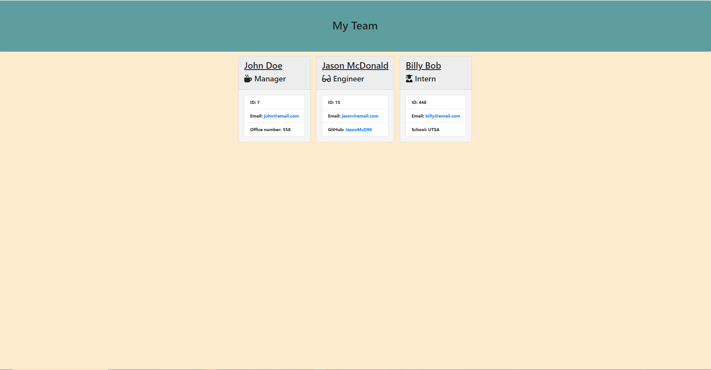

# Team Profile Generator

Team Generator prompts the user to enter names and information about their team. The user can add as many team members
as the wish. Using inquirer the program is able to easily prompt and recieve input from the user. Once the user has entered all neccessary information
the program then creates an html page from the data the user entered
## Link to demo video

```
https://github.com/JasonMcD96/Team-Profile-Generator/blob/main/Assets/demo.mp4
```


## Preview Image

